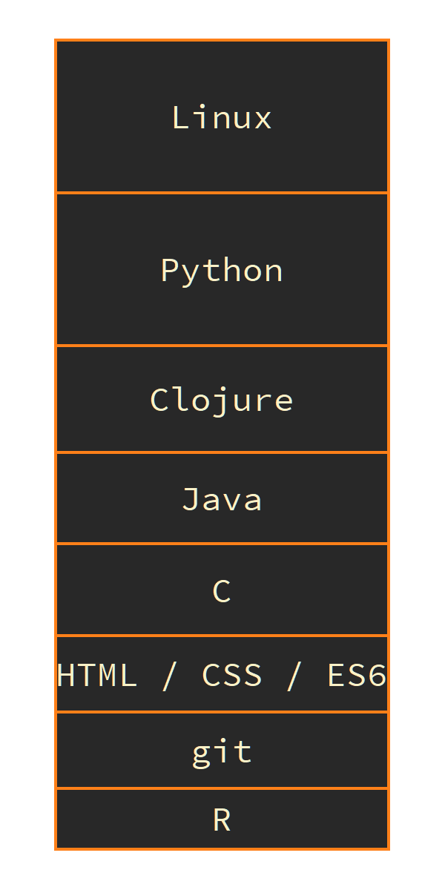

# techstack
 A small script to create a techstack image for usage in your CV

### How?
Takes two input vectors (Topic and Weight) and creates a sorted stacked bar chart with predefined colors and font.
|'Python'|'Linux'|'Clojure'| ... |
|--------|-------|---------|-----|
|      10|     11|        8| ... |

Using RStudio you could easily adjust the dimensions by clicking `Export` -> `Save as Image`

